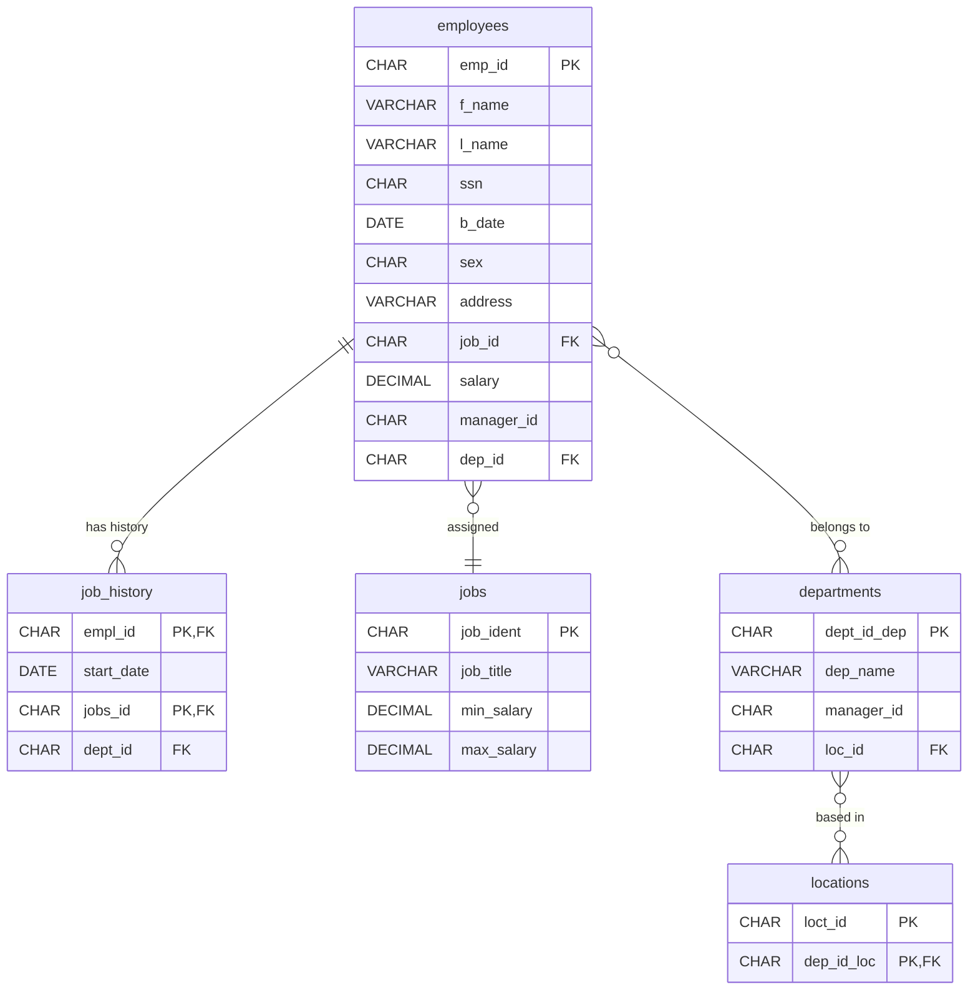

# sql_sub_querries_data_analysis_ project

### Objective

This project is designed as a SQL and data analysis practice exercise.
The goal is to simulate a small company database with employees, jobs, departments, and locations.
By creating tables, inserting realistic data, and running queries, you can practice database design, writing queries, and analyzing results.

### Steps

### 1. Create the Schema

Start by creating the database tables (employees, job_history, jobs, departments, locations).
This step gives you hands-on practice in defining database structure and relationships.

### 2. Insert Sample Data

Load realistic test data into the tables.
This provides a base for queries and allows you to simulate real-world employee and company data.

### 3. Practice SQL Queries

- Work through a series of challenges that cover:

- Aggregations (average, max, min)

- Subqueries

- Filtering with conditions

- Age and salary analysis

Working with job history

Each query is a small data analysis task, helping you learn how to extract insights from raw data.

### Schema Visualization  
Mermaid ER diagrams included for clear data structure mapping.  

